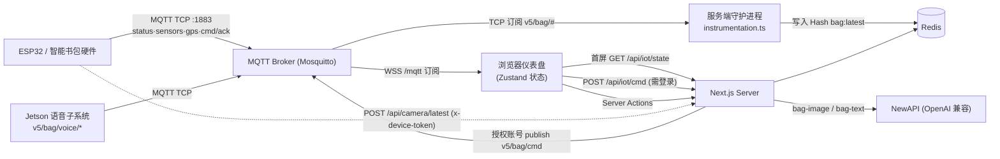

# Smart Schoolbag V5.0

> 面向儿童安全与家校协同的智能书包 IoT 数字孪生仪表盘 —— 把真实硬件上报的电量、温湿度、GPS、摄像头快照与命令回执汇聚到一个 Web 面板，并用 AI 辅助理解图像与文字，形成「硬件 → 云端 → 前端 → AI → 设备反馈」的完整闭环。

[](https://nextjs.org/)
[](https://react.dev/)
[](https://www.typescriptlang.org/)
[](https://mqtt.org/)
[](https://redis.io/)
[](https://tailwindcss.com/)
[](#许可证)
[](https://bag.versecraft.cn)

## 这是什么

传统「智能硬件系统」常常停留在硬件串口或一张静态展示页，使用者很难直观确认整条链路是否真的打通。本项目把硬件状态、地图定位、摄像头快照、AI 分析与命令下发放进同一个可访问的 Web 仪表盘，重点体现工程落地能力：

- 设备数据经由真实 MQTT Topic 进入系统，而不是前端假数据。
- 浏览器「连接到 Broker」与设备本体「在线」是两层独立状态，避免误判。
- 页面刷新后仍能从 Redis 镜像恢复最近一次设备快照。
- AI 结果经 JSON 解析与 Zod 校验，失败时返回可读的中文错误。
- 下发给设备的命令由服务端授权账号发布（QoS 1），形成可追踪闭环。

🔗 **在线体验：<https://bag.versecraft.cn>**

## ✨ 核心特性

- **实时 IoT 数据流**：浏览器通过 MQTT over WebSocket 订阅 `v5/bag/*` 全部业务 Topic，传感器、GPS、状态、命令回执即时刷新；连接断开/重连有 Toast 提示。基于真实 broker 而非模拟数据。
- **刷新即恢复**：`instrumentation.ts` 在 Node 运行时启动一个服务端守护进程，订阅 `v5/bag/#` 并把最新值镜像写入 Redis Hash `bag:latest`；前端首屏调用 `/api/iot/state` 拉取，避免刷新后状态清零。
- **设备/语音双在线模型**：ESP32 传感板的在线态走 `v5/bag/status`，Jetson 语音子系统（命名空间 `v5/bag/voice/*`）独立维护在线态与事件，二者各用一套 last-seen 字段（`lastSeenAt` / `voiceLastSeenAt`）互不污染，UI 分开展示。
- **AI 视觉 + 文本双链路**：视觉先调用 `bag-image`（多模态）输出 `objects / scene / risks / confidence / raw_summary` 结构化结果，再交给 `bag-text` 生成中文 `analysis / suggestion / screen_text / severity`；两步都用 Zod 强校验，不让模型臆造内容直接落地。
- **命令下发收敛到服务端**：`/api/iot/cmd` 要求登录后由服务端授权账号 publish（QoS 1）到 `v5/bag/cmd`，仅允许 `mode_switch / screen_text / set_timetable` 三类动作、限制 `value` 长度，便于在 broker 侧关掉匿名写权限，杜绝任意客户端注入指令。
- **AI 前置安全闸**：家长消息先经 `bag-text` 润色与风险分级，`severity=high` 时阻止自动下发、提示人工确认，AI 不直接控制硬件。
- **国内地图坐标适配**：硬件上报 WGS-84 坐标，前端转换为 GCJ-02 后在 AMap 渲染并维护轨迹线（`lib/coord-transform.ts`）。
- **生产可观测**：`/api/iot/daemon-status` 输出 Redis / MQTT 连接、订阅状态、最近镜像 Topic 与时间；日志与诊断信息均对 URL 凭证、`Bearer` token、`sk-` 密钥做脱敏。
- **轻量自带账号体系**：scrypt 口令哈希 + Redis 会话（`sb_session` cookie，7 天滑动续期），无需引入数据库；`proxy.ts` 做页面级守卫，API 路由各自返回 401。

## 🏗 架构



数据流要点：硬件与浏览器连同一个 broker，但服务端额外维护一条 `MQTT → Redis` 镜像，用于跨刷新恢复；命令链路统一收敛到服务端授权发布。

## 🧰 技术栈

| 维度 | 选型 | 说明 |
| --- | --- | --- |
| 框架 | Next.js 16 (App Router) | 单体应用，`output: 'standalone'`，Server Actions + API Routes |
| 运行时 | React 19 / TypeScript 5.7 / Node ≥ 20.9 | 包管理器 pnpm 9（`packageManager: pnpm@9.15.9`） |
| 状态管理 | Zustand 5 | 客户端实时 IoT 状态（`store/useIoTStore.ts`） |
| 实时通信 | mqtt.js 5 | 浏览器 WSS 订阅 + 服务端 TCP 守护/发布 |
| 缓存/会话 | Redis（ioredis 5） | 设备状态镜像、账号与会话存储 |
| AI 接入 | NewAPI（OpenAI 兼容） | 视觉/文本统一走 `bag-image` / `bag-text` 别名 |
| 地图 | AMap JS API（`@amap/amap-jsapi-loader`） | WGS-84 → GCJ-02 坐标转换 |
| UI | Tailwind CSS 4 + shadcn/ui (Radix) + lucide-react | `recharts` 图表、`sonner` 通知 |
| 校验 | Zod 3 | 模型结构化输出与表单校验 |
| 部署 | Docker（multi-stage）+ Nginx + Mosquitto + Redis | Coolify 编排，见下文 |

> 模型别名 `bag-image` / `bag-text` 由 NewAPI 侧映射到实际模型；代码默认上游为小米 MiMo（视觉 `mimo-v2-omni`、文本 `mimo-v2-flash`，并默认关闭思维链以降延迟），可用 `BAG_VISION_MODEL` / `BAG_TEXT_MODEL` 覆盖。

## 🚀 快速开始

前置依赖：Node.js ≥ 20.9、pnpm 9、本地 Redis、本地 Mosquitto（需同时开启 TCP 与 WebSocket 监听）。

```bash
# 克隆
git clone https://github.com/bei666qi-pan/smart-bag.git
cd smart-bag

# 安装依赖
pnpm install

# 配置环境变量
cp .env.example .env.local
# 按需填入 AMap / NewAPI 等密钥（见下方「配置」）

# 启动开发服务器（默认 http://localhost:3000）
pnpm dev
```

可用脚本（见 `package.json`）：

```bash
pnpm dev      # 开发模式（next dev）
pnpm build    # 生产构建（next build）
pnpm start    # 生产启动（next start -H 0.0.0.0 -p 3000）
pnpm lint     # ESLint flat config（eslint .）
```

### 本地 IoT 联调

启动一个同时支持 TCP(1883) 与 WebSocket(8083) 的 Mosquitto，并在 `.env.local` 指向本地：

```bash
mosquitto -c mosquitto.conf   # 可参考 mosquitto.conf.example
```

```bash
# .env.local（本地）
NEXT_PUBLIC_MQTT_URL=ws://localhost:8083/mqtt
MQTT_SERVER_URL=mqtt://localhost:1883
REDIS_URL=redis://localhost:6379
```

发布测试数据与下发命令：

```bash
mosquitto_pub -h localhost -t "v5/bag/status"  -m '{"status":"online"}'
mosquitto_pub -h localhost -t "v5/bag/sensors" -m '{"battery":85,"temp":24,"humid":45}'
mosquitto_pub -h localhost -t "v5/bag/gps"     -m '{"lat":31.2304,"lng":121.4737}'
mosquitto_pub -h localhost -t "v5/bag/cmd"     -m '{"id":"demo-1","action":"screen_text","value":"记得喝水"}'
mosquitto_pub -h localhost -t "v5/bag/cmd/ack" -m '{"cmd_id":"demo-1","status":0,"msg":"OK"}'
```

更完整的步骤见 [`docs/IOT_TESTING_GUIDE.md`](docs/IOT_TESTING_GUIDE.md)。

## ⚙️ 配置

环境变量统一通过模板文件管理，**请勿把真实密钥提交到仓库**。本地复制 `.env.example` 到 `.env.local`；部署时在平台上注入。`smart.txt.example` 是带占位符的部署速记样例（仅 `YOUR_*` / `CHANGE_ME_*` 占位，无任何真实凭据）。

| 变量 | 说明 | 必需性 |
| --- | --- | --- |
| `NEXT_PUBLIC_MQTT_URL` | 浏览器 MQTT WebSocket 地址，如 `wss://bag.versecraft.cn/mqtt` | 核心功能必需 |
| `NEXT_PUBLIC_MQTT_PATH` | WebSocket path，默认 `/mqtt`（URL 已含 path 时可省） | 可选 |
| `MQTT_SERVER_URL` | 服务端守护/发布连接的 MQTT TCP 地址 | Redis 镜像 / 命令下发必需 |
| `REDIS_URL` | Redis 连接地址（账号、会话、状态镜像共用） | 必需 |
| `NEXT_PUBLIC_AMAP_KEY` | 高德地图 Web JS API Key | 位置页必需 |
| `NEXT_PUBLIC_AMAP_SECURITY_CODE` | 高德地图安全密钥 | 位置页必需 |
| `NEXT_PUBLIC_ESP32_STREAM_URL` | 局域网 ESP32 摄像头视频流地址 | 视觉页 LAN 模式可选 |
| `NEWAPI_BASE_URL` | NewAPI 服务地址 | AI 功能必需（或由用户在设置页填入） |
| `NEWAPI_API_KEY` | NewAPI 密钥（仅服务端读取） | AI 功能必需（或由用户在设置页填入） |
| `DEVICE_TOKEN` | 摄像头上传令牌，ESP32 须以 `x-device-token` 携带；未配置则拒绝所有设备上传 | 摄像头 WAN 上传必需 |
| `BAG_VISION_MODEL` / `BAG_TEXT_MODEL` | 覆盖默认视觉/文本模型名 | 可选 |

> AI 配置支持两级回退：优先使用用户在「设置」页填入的 NewAPI key（按用户存于 Redis、回显仅掩码），缺省则回退服务端环境变量。

## 📁 目录结构

```text
.
├── app/
│   ├── (dashboard)/        # 受保护的仪表盘路由组：总览 / location / vision / interaction / settings
│   ├── login/              # 登录页（注册同页）
│   ├── actions/            # Server Actions：analyze-image / analyze-text（AI 链路）
│   └── api/                # auth / iot(state·status·cmd·daemon-status) / camera(latest·status) / settings
├── components/
│   ├── dashboard/          # 业务区块：bento 总览、location/vision/interaction、诊断卡、课表编辑器
│   └── ui/                 # shadcn/ui 组件
├── lib/
│   ├── iot/                # redis-mqtt-daemon（镜像守护）、mqtt-command（服务端发布）
│   ├── newapi.ts           # NewAPI 客户端：超时、重试、错误归一化、脱敏
│   ├── auth.ts             # scrypt 口令哈希 + Redis 会话
│   ├── redis.ts            # ioredis 单例
│   ├── coord-transform.ts  # WGS-84 → GCJ-02
│   └── gbk-courses.ts      # 课表下行的课程名 → GBK 字节静态表
├── hooks/useMqttClient.ts  # 浏览器 MQTT 订阅与状态分发
├── store/useIoTStore.ts    # Zustand 实时状态
├── instrumentation.ts      # 启动时拉起 MQTT→Redis 守护进程
├── proxy.ts                # Next 16 页面级会话守卫（原 middleware）
├── docs/                   # ARCHITECTURE / IOT_TESTING_GUIDE / AMAP_* 等
├── Dockerfile              # 三阶段构建，产出 standalone
├── docker-compose.yml.example  # nginx + web + mqtt + redis 编排样例
├── mosquitto.conf.example      # Mosquitto TCP(1883)+WS(8083) 监听样例
└── nginx/default.conf.example  # Nginx 反代样例
```

## 数据与 Topic 约定

| Topic | 方向 | 示例 |
| --- | --- | --- |
| `v5/bag/status` | 设备 → 系统 | `{ "status": "online" }` |
| `v5/bag/sensors` | 设备 → 系统 | `{ "battery": 85, "temp": 24, "humid": 45 }` |
| `v5/bag/gps` | 设备 → 系统 | `{ "lat": 31.2304, "lng": 121.4737 }` |
| `v5/bag/cmd` | 系统 → 设备 | `{ "id": "uuid", "action": "screen_text", "value": "记得喝水" }` |
| `v5/bag/cmd/ack` | 设备 → 系统 | `{ "cmd_id": "uuid", "status": 0, "msg": "OK" }` |
| `v5/bag/voice/status` | 语音子系统 → 系统 | Jetson 在线态（独立于设备本体） |
| `v5/bag/voice/event` · `voice/cmd` · `voice/health` | 语音子系统 → 系统 | 语音事件、语音发起的指令、麦克风健康态 |

> 命令仅接受 `mode_switch / screen_text / set_timetable`。其中 `set_timetable` 下行的课程名通过 `lib/gbk-courses.ts` 的静态表转成 GBK 字节，适配书包屏幕的 GBK 字库（端侧保持「哑终端」）。

## 摄像头链路

视觉中心支持两种输入：

- **LAN 模式**：直接读取 `NEXT_PUBLIC_ESP32_STREAM_URL`。同一局域网调试方便；若页面为 HTTPS 而视频流为 HTTP，浏览器会按 Mixed Content 拦截。
- **WAN 模式**：硬件以 `multipart/form-data`（字段名 `image`）+ 请求头 `x-device-token` 调 `POST /api/camera/latest`；浏览器登录后轮询 `GET /api/camera/latest`，并可经 `/api/camera/status` 查看快照是否就绪。

## 🚢 部署

线上 <https://bag.versecraft.cn> 走「**GitHub（事实源）→ Gitee 镜像 → Coolify → 火山引擎 ECS**」链路：代码以 GitHub 为准、镜像同步到 Gitee 以便国内拉取，Coolify 在火山引擎服务器上按 `docker-compose.yml.example`（nginx + web + mqtt + redis）编排部署。

构建侧要点（与仓库一致）：

- `Dockerfile` 为三阶段构建（deps → builder → runner），基于 `node:22-alpine`，产出 Next.js `standalone`，运行 `node server.js`，监听 `:3000`。
- `NEXT_PUBLIC_*` 变量需在**构建期**通过 build args 注入（见 `docker-compose.yml.example`），服务端变量在**运行期**注入。
- Mosquitto 的 WebSocket(8083) 由 Traefik 暴露为 WSS，对齐生产浏览器只用规范 WSS 地址，规避 Mixed Content。

凭证细节不在本文展开；请在 Coolify / 部署平台以环境变量形式配置。

## 相关文档

- [架构说明](docs/ARCHITECTURE.md)
- [IoT 联调指南](docs/IOT_TESTING_GUIDE.md)
- [AMap 迁移说明](docs/AMAP_MIGRATION.md)
- [软硬件对接文档](软硬件对接文档.md) · [语音联动说明](语音联动说明.md)

## 许可证

仓库未声明许可证（无 LICENSE 文件），默认保留所有权利。如需使用请联系作者。
